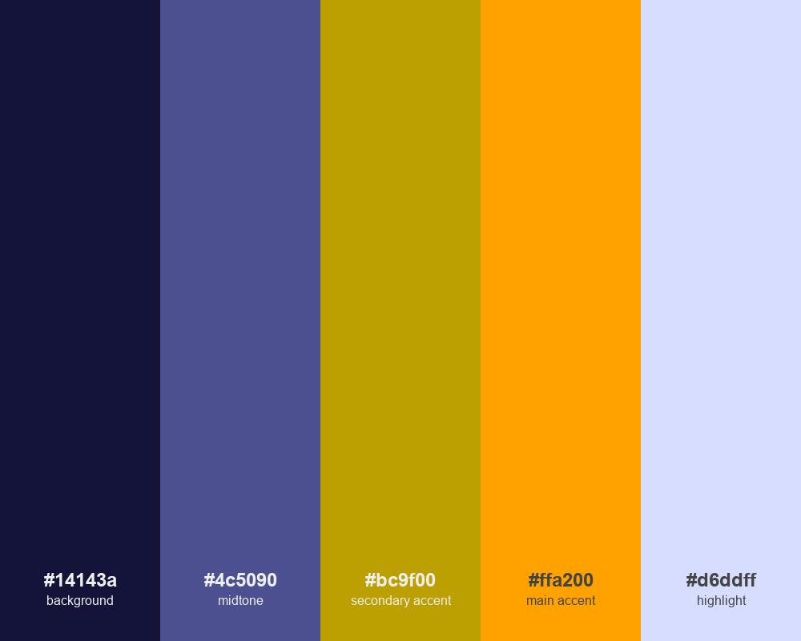
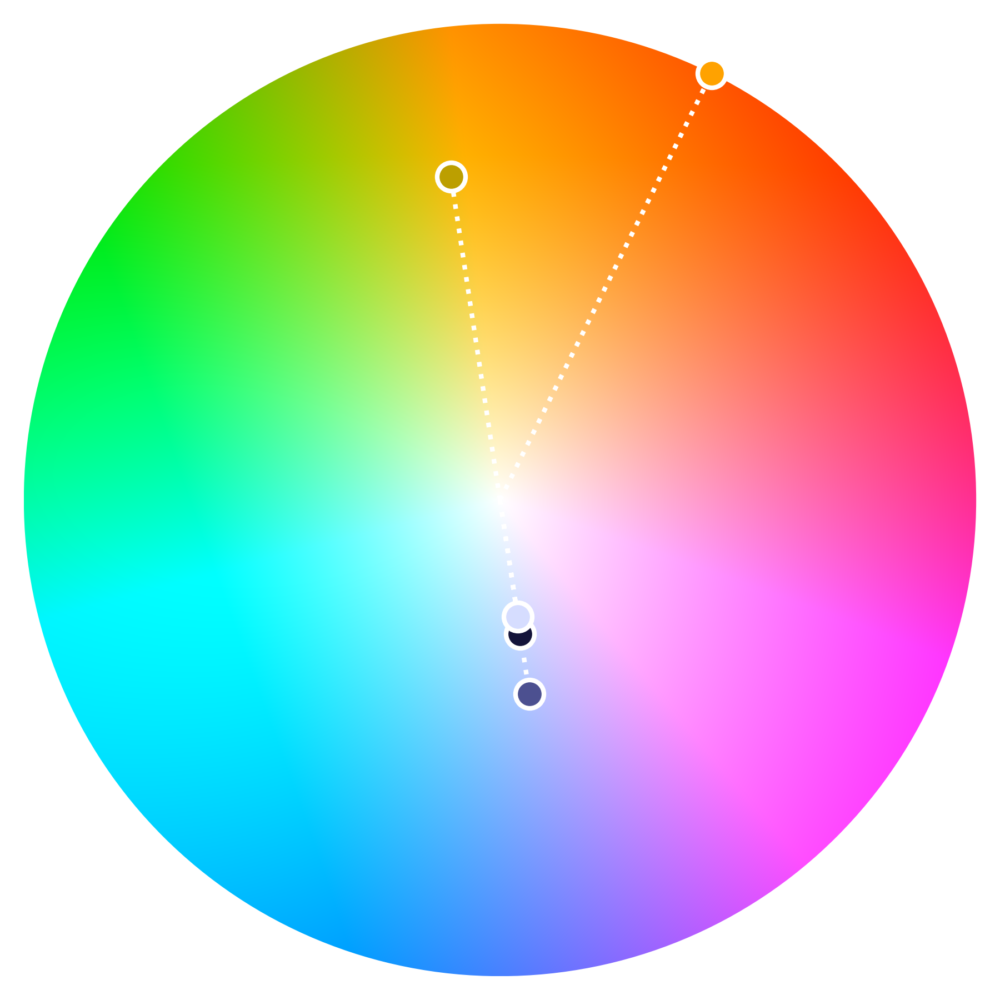
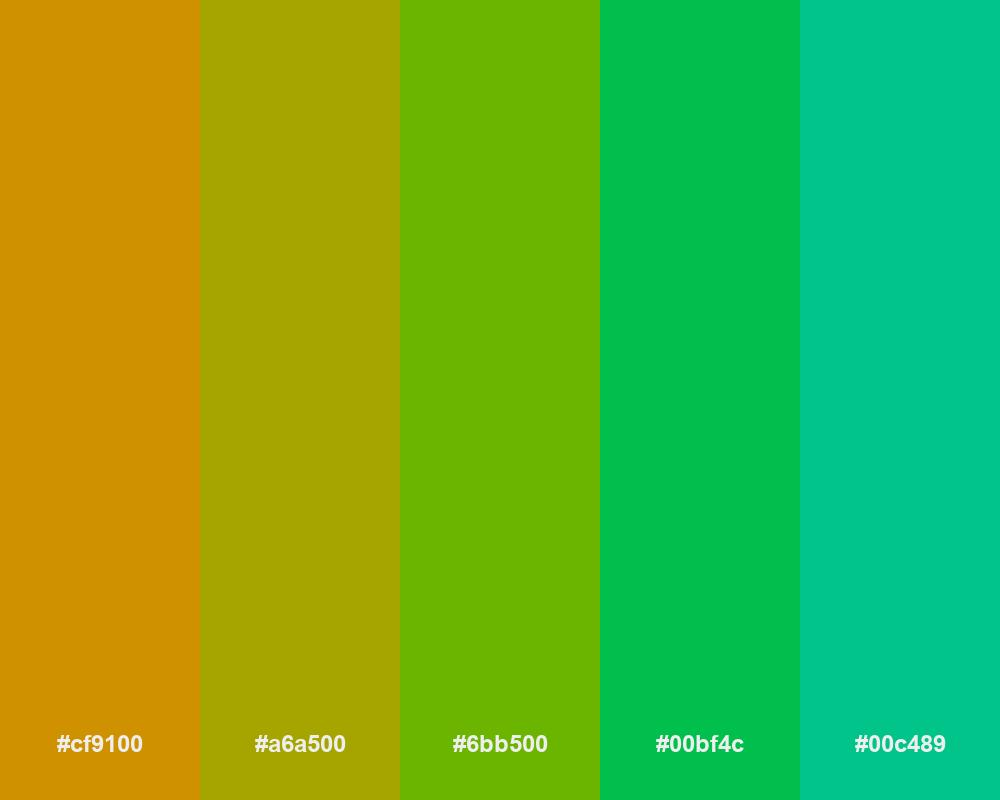
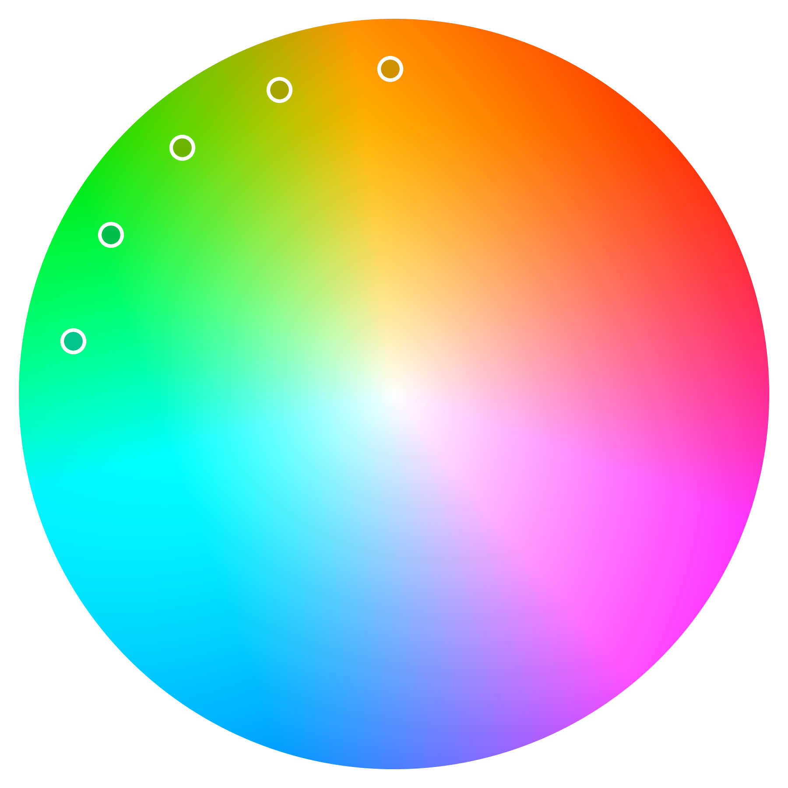
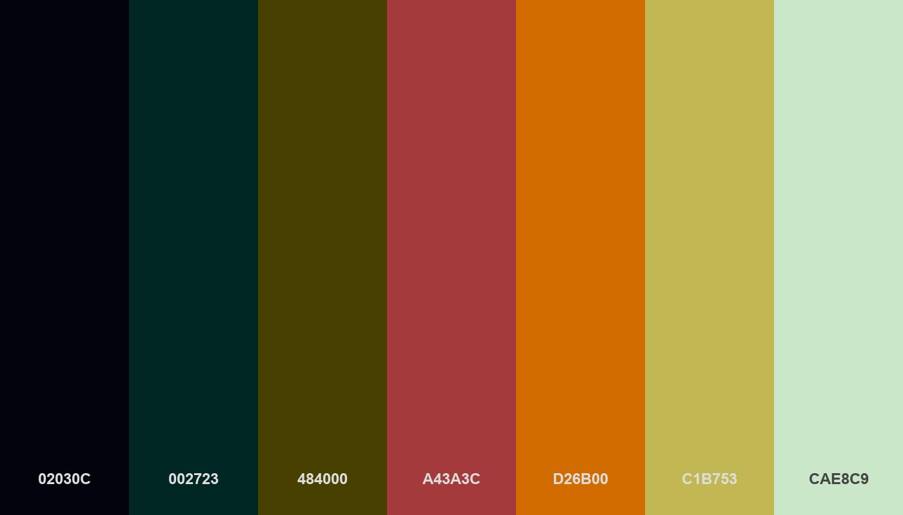

# py-color-mixer
Python utility to create and process color palettes

A collection of color math functions to procedurally create color palettes. This is an extension of the Python script I used for my [procedural graffiti generator](https://www.artstation.com/artwork/DvVJNG). 

It is mostly build around the [OKLCH](https://oklch.com) color space to create palettes based on color harmonies but there are conversions to some other color spaces, like [OKLAB](https://bottosson.github.io/posts/oklab/) for interpolating between colors.

The palettes are built on Numpy and all operations work on whole color palettes. Even single colors are implemented as color palettes.

To make sure our colors don't compete with one another we can assign them roles. 
Example palette based on a (slightly shifted) split complement harmony.

Usually I find analogous palettes difficult to use. But applying the roles sets the lightness and chroma accordingly, so that we still get a functional result.

OKLCH is designed to maintain a consistent perceived brightness. So it is quite easy to remap random colors to have a linear gradient.
Example from my [Unity dithering project](https://www.artstation.com/artwork/dyA5g3):

