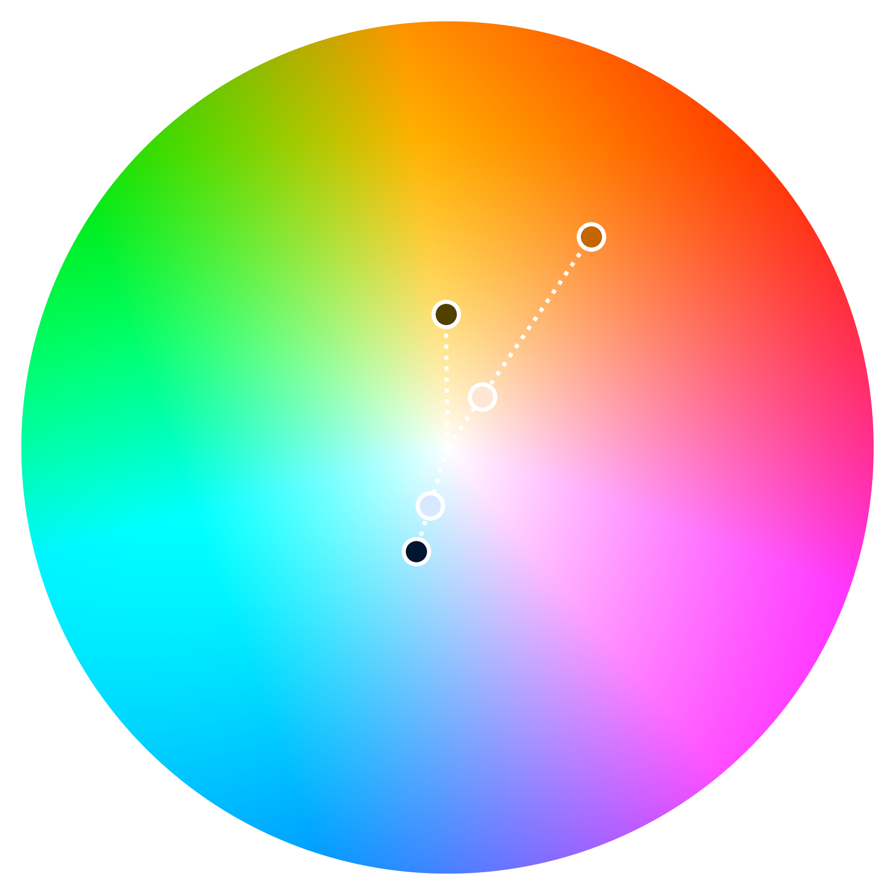
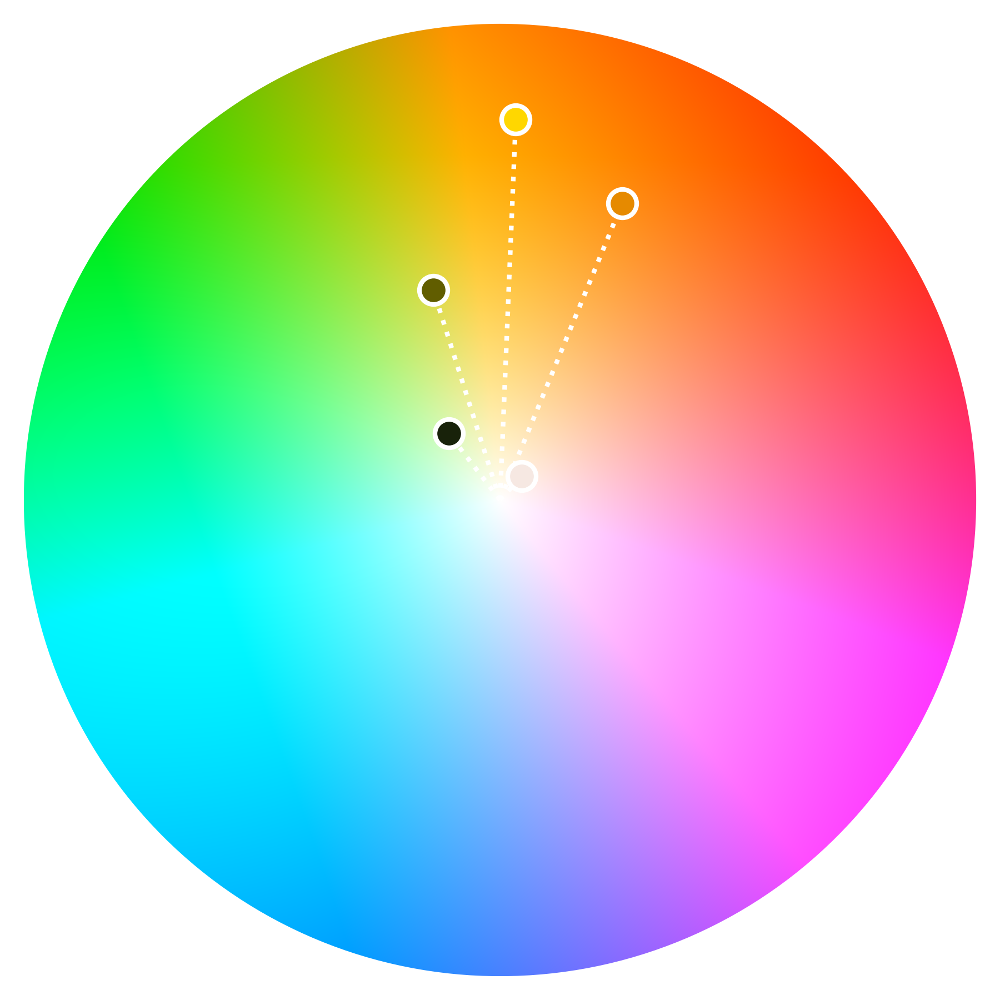
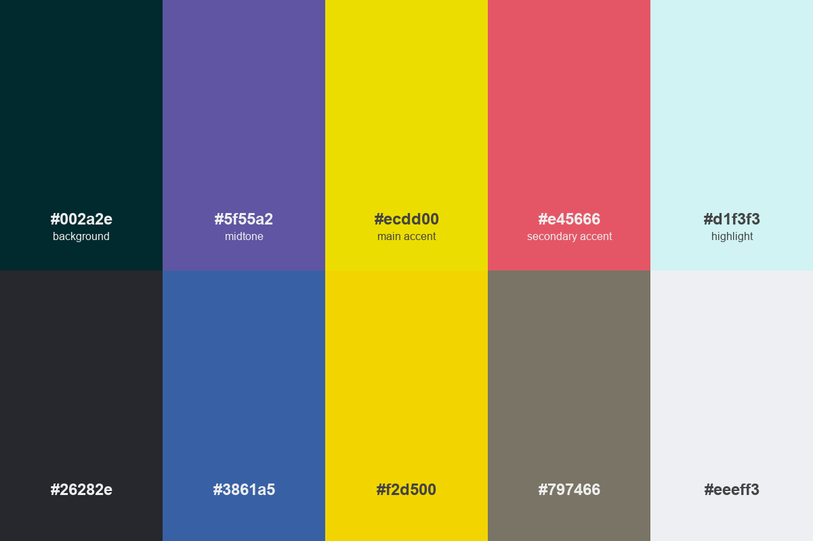
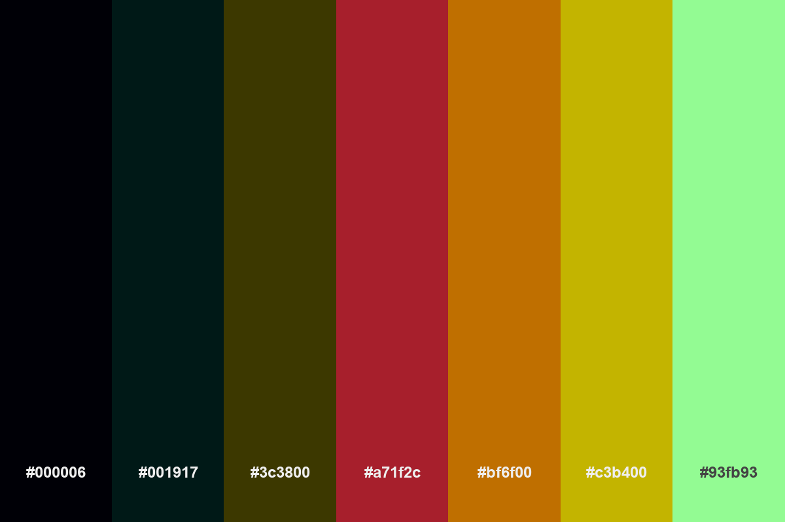
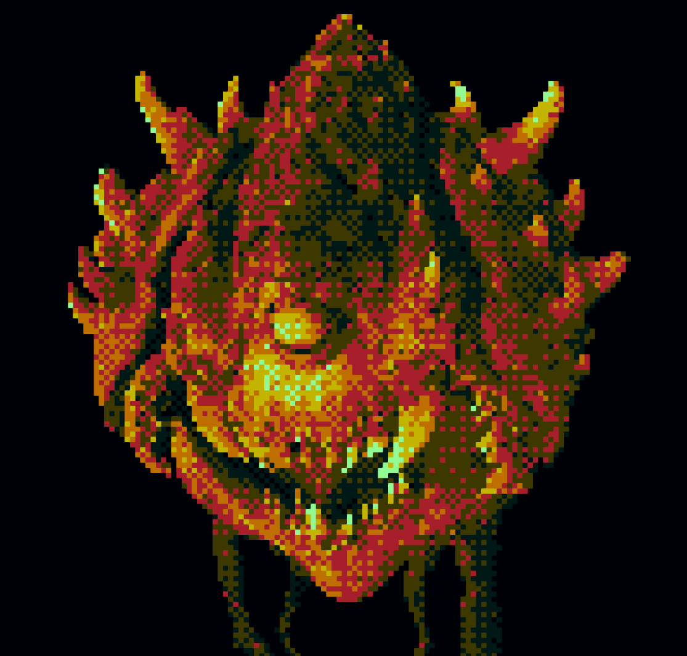

# py-color-mixer
Python utility to procedurally generate and process usable artistic color palettes. No AI just math.

A collection of color math functions to procedurally create color palettes. It is an iteration on a Python script for Substance Designer I wrote for my [procedural graffiti generator](https://www.artstation.com/artwork/DvVJNG) and yields much better results.

It is mostly build around the [OKLCH](https://oklch.com) color space to create palettes based on color harmonies but there are conversions to some other color spaces, like [OKLAB](https://bottosson.github.io/posts/oklab/) for interpolating between colors, sRGB to import/export hex codes, etc.

The palettes are built on Numpy and all operations work on whole color palettes. Even single colors are implemented as color palettes.

## usage
To make sure our colors don't compete with one another we can assign explicit roles to them. 
Example palette based on a (slightly shifted) split complement harmony.
```python
roles = [
  Role.DEEP_BASE,
  Role.MID_SUPPORT,
  Role.HERO_ACCENT,
  Role.SECOND_ACCENT,
  Role.HIGHLIGHT
]

root   = OKLCHPalette.new_random(1,seed=None)  # -> palette of size 1
splits = root.split_complement(bias=30)        # -> palette of size 2

colors = ( 
  OKLCHPalette.merge(root, root, sc, root) # -> palette of size 5
  .apply_roles(roles)
  .make_srgb_safe()   # prettier than clipping, just in case we went out of gamut along the way
)

hex_codes = colors.to_hex()   # will handle the OKlch-sRGB conversion
```



## Analogous example
Aapplying the roles sets the lightness and chroma accordingly, so that we get a palette with enough contrast.




## Color Vision deficency emulation
You can quickly check you palettes against the most common types of color vision deficiency.
- Protanopia / Protanomaly(50%)
- Deuteranopia / Deuteranomaly (50%)
- Tritanopia / Tritanomaly (50%)

The full severity transformations are taken straight from colour-science, the 50% severities are estimates.
I would recommend using the [colour-science](https://colour.readthedocs.io/en/develop/) directly, just to be sure.

A square harmony palette with and without protanopia emulation:



The original example:


and with protanopia emulation:


## Linear Lightness example

OKLAB and OKLCH are designed to maintain a consistent perceived brightness. This comes in very useful to create colors with gradual brightness.
Example from my [Unity dithering project](https://www.artstation.com/artwork/dyA5g3):






vecteezy.com/free-vector/corporate

vecteezy.com/free-vector/leopard

vecteezy.com/free-vector/floral

freevector.com/geometric-poster-98922
